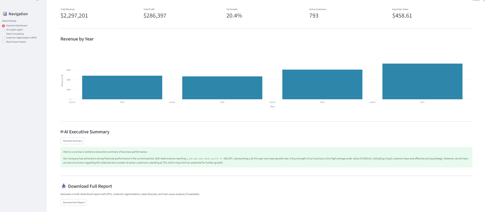
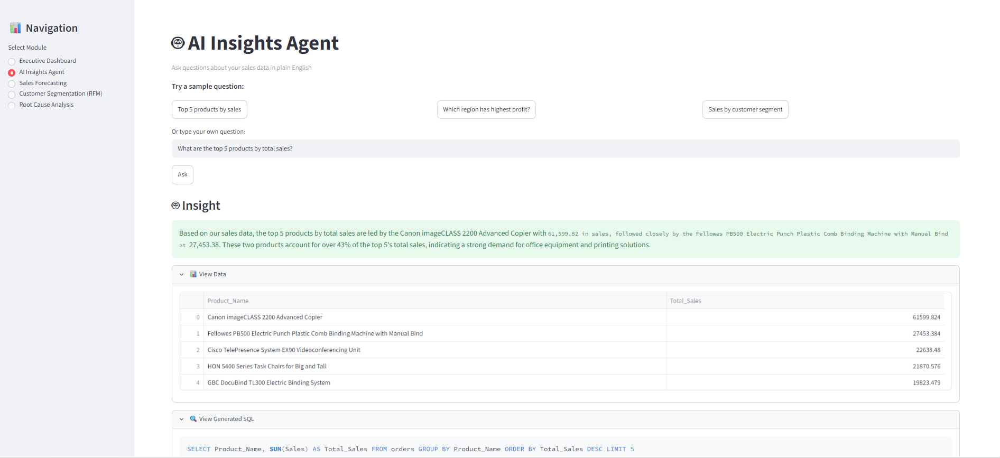
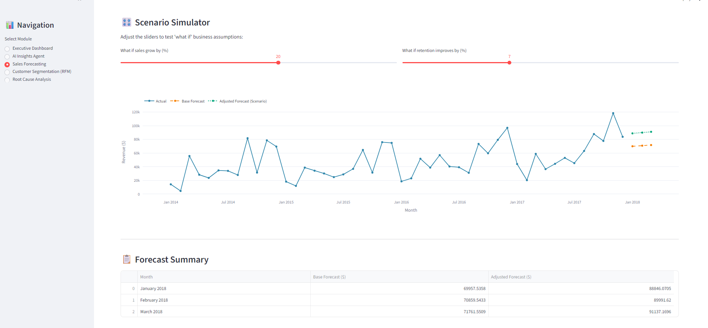
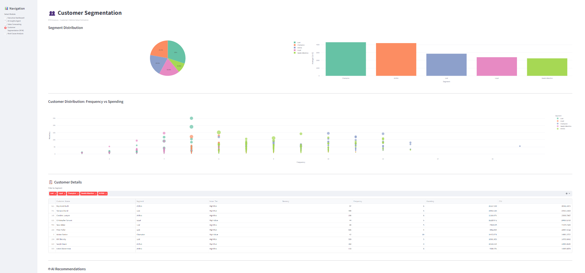
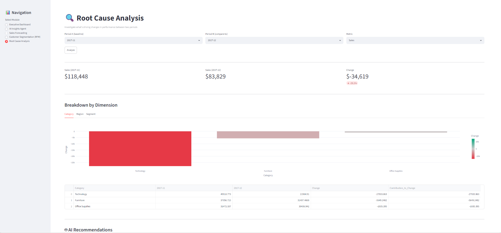

markdown
# 🛒 AI-Powered Retail Analytics Platform

> **Transforming raw sales data into actionable business intelligence** — featuring a natural language SQL agent, sales forecasting, customer segmentation, root cause analysis, AI recommendations, and one-click Excel reporting.

[](https://python.org)
[](https://streamlit.io)
[](https://groq.com)
[](https://scikit-learn.org)
[](https://opensource.org/licenses/MIT)

---

## ⚡ Quick Summary

| | |
|---|---|
| **Dataset** | Kaggle Superstore Sales — 9,994 orders, 4 years (2014–2017) |
| **Stack** | Python · Streamlit · Groq LLM · LangChain · scikit-learn · Pandas · Plotly · SQLite · openpyxl |
| **Modules** | 7 analytics modules covering descriptive → diagnostic → predictive → prescriptive analytics |
| **AI Features** | Natural language to SQL, AI executive summaries, AI business recommendations |

---

## 🎯 Why I Built This

Most portfolio projects stop at "here's a chart of sales by region." I wanted to build something that mirrors what a real BI platform does — not just describing what happened, but explaining why, predicting what's next, and recommending what to do about it.

This project covers the **full analytical cycle**:

| Question | Module |
|---|---|
| What's happening? | Executive Dashboard |
| Why is it happening? | Root Cause Analysis |
| What will happen next? | Sales Forecasting |
| Who are our customers? | RFM + CLV Segmentation |
| What should we do? | AI Recommendation Engine |

---
## 🌐 Live Demo

👉 **[Launch Live App](https://ai-retail-analytics-platform-ykxfx2b7gzabgt388ijvpg.streamlit.app/)**

> App may take 30-60 seconds to wake up on first visit (Streamlit Cloud free tier)

---

## 📊 Project Metrics
📦 9,994 orders analyzed            👥 793 customers segmented
🧩 7 analytics modules              🤖 3 AI-powered features
🗄️ 1 SQLite database                📥 1-click Excel report (4 sheets)
📈 3-month sales forecast           🔍 Natural language → SQL pipeline

---

## 🏗️ Architecture

```
superstore.csv
    ↓
data_loader.py (Pandas)
    ↓
superstore.db (SQLite)
    ↓
┌────────────────────────────────────────┐
│         Analytics Modules              │
│ KPI · Agent · Forecast · RFM · RCA     │
│ Recommendations · Report Generator     │
└────────────────────────────────────────┘
    ↓                     ↓
Groq LLM              Plotly Charts
(AI Insights)         (Visualization)
    ↓                     ↓
└──────── Streamlit Dashboard ──────────┘
    ↓
Excel Report (.xlsx)
```

---

## 🤖 AI Workflow (Natural Language → SQL → Insight)

**User Question**  
> "Which region has the highest profit?"

---

**Prompt Engineering (Schema Injection)**  
↓

**Groq LLM (llama-3.1-8b-instant)**  
↓

**SQL Generation**
```sql
SELECT Region, SUM(Profit)
FROM orders
GROUP BY Region
ORDER BY SUM(Profit) DESC;
```

↓

**SQLite Execution**  
↓

**Pandas DataFrame**  
↓

**AI Insight Generation**  
↓

> "West region leads with $108,418 in profit"

---

## 🔑 Key Design Decision

Injecting the full table schema into every prompt was the most important improvement.

### Without it:
- LLM guesses column names ❌  
- SQL breaks ❌  

### With it:
- Accurate SQL generation ✅  
- Stable query execution ✅    
---

## 🚀 Modules

### Executive Dashboard


### 📊 Module 0: Executive Dashboard
**Business Problem:** Leadership needs a single-screen view of business health without digging through raw data.

**Solution:** Auto-calculated KPI scorecards (Revenue, Profit, YoY Growth, Active Customers, AOV) with a revenue trend chart and an AI-generated executive summary.

**Business Impact:** Reduces time-to-insight for leadership from hours to seconds. AI summary surfaces the most important trend in plain English automatically.

---

### AI Insights Agent


### 🤖 Module 1: AI Insights Agent
**Business Problem:** Analysts spend significant time writing ad-hoc SQL queries to answer one-off business questions.

**Solution:** Natural language interface that converts plain English questions to SQL, executes them against the database, and returns AI-written business insights with supporting data.

**Business Impact:** Democratises data access — non-technical stakeholders can query data directly without SQL knowledge.

---
### Sales Forecasting


### 📈 Module 2: Sales Forecasting + Scenario Simulator
**Business Problem:** Planning teams need revenue projections for budgeting, and need to model "what if" assumptions before committing to targets.

**Solution:** Linear Regression model trained on 48 months of historical data to predict next 3 months revenue, with interactive sliders for sales growth and retention improvement scenarios.

**Why Linear Regression?** Chosen deliberately as a lightweight, interpretable baseline model. The overall upward trend in the data (20.4% YoY growth) is well-captured by a linear trend line. It is designed to be swappable with Prophet or XGBoost in a future version for seasonality-aware forecasting.

**Business Impact:** Gives planning teams a data-backed baseline forecast with instant scenario modeling — no Excel macros needed.

---

### Customer Segmentation


### 👥 Module 3: Customer Segmentation (RFM + CLV)
**Business Problem:** Marketing teams treat all customers the same, wasting budget on low-value customers while under-investing in high-value ones.

**Solution:** RFM scoring (Recency, Frequency, Monetary) segments all 793 customers into Champion, Loyal, At Risk, Lost, and Needs Attention groups. Customer Lifetime Value (CLV) extends this by estimating long-term revenue per customer.

**Business Impact:** At Risk customers have nearly identical average CLV ($4,219) to Champions ($4,330) — identifying them as a priority retention target with significant recoverable revenue potential.

---
### Root Cause Analysis


### 🔍 Module 4: Root Cause Analysis
**Business Problem:** When revenue changes, it's rarely obvious which product category, region, or customer segment caused the shift.

**Solution:** Period-over-period comparison tool that automatically breaks down changes in Revenue, Profit, or Orders across Category, Region, and Segment dimensions — with color-coded charts (red = decline, green = growth).

**Business Impact:** Turns "revenue dropped 15% last month" from a vague concern into a specific, actionable finding: "Office Supplies in the Central region drove 68% of the decline."

---

### 💡 Module 5: AI Recommendation Engine
**Business Problem:** Analysts produce data findings but struggle to translate them into concrete business actions for non-technical stakeholders.

**Solution:** After each analysis (RFM, Root Cause), a Groq-powered engine reads the actual data summary and generates 3-4 specific, numbered recommendations referencing real numbers from the dataset.

**Business Impact:** Bridges the gap between analysis and action — recommendations are grounded in data, not generic best practices.

---

### 📥 Module 6: Auto Report Generator
**Business Problem:** Compiling analysis results into a shareable report is time-consuming and prone to copy-paste errors.

**Solution:** One-click Excel workbook with 4 styled sheets: Executive Summary, Customer Segmentation, Sales Forecast, and Root Cause Analysis (auto-included if run in session).

**Business Impact:** Stakeholders get a clean, formatted, shareable report in seconds — no manual Excel work required.

---

## 🛠️ Tech Stack

| Layer | Tools |
|---|---|
| Language | Python 3.14 |
| Web App | Streamlit |
| AI / LLM | Groq (`llama-3.1-8b-instant`), LangChain |
| Data Processing | Pandas, NumPy |
| Machine Learning | scikit-learn (Linear Regression) |
| Visualisation | Plotly |
| Database | SQLite |
| Reporting | openpyxl |
| Environment | python-dotenv |

---

## 🧠 Skills Demonstrated

`Python` `SQL` `Streamlit` `Pandas` `Data Cleaning` `Data Modeling`
`Machine Learning` `Forecasting` `Business Intelligence` `Data Visualisation`
`RFM Analysis` `Customer Lifetime Value (CLV)` `Root Cause Analysis`
`Prompt Engineering` `LLM Integration` `Excel Automation` `SQLite`
`LangChain` `Groq API` `Modular Architecture`

---

## 🔧 Technical Challenges Solved

**1. Preventing SQL hallucinations**
Injecting the full table schema (column names, types, relationships) into every LLM prompt was critical. Without this, the model guesses column names and generates broken queries. Schema injection dropped SQL errors to near-zero.

**2. Streamlit session state management**
Streamlit reruns the entire script on every interaction. Managing state across multiple button clicks (e.g. sample questions pre-filling the text input, RCA results persisting for report generation) required careful use of `st.session_state`.

**3. Modular architecture**
Each analytics module is a standalone Python file with a single main function that returns a clean dictionary. This makes each module independently testable (see `tests/` folder) and easy to extend without breaking other modules.

**4. Dynamic Excel reporting**
The report generator uses `io.BytesIO()` to build the Excel file in memory rather than writing to disk — the standard pattern for Streamlit download buttons. Handling `MergedCell` objects in `openpyxl` required a custom column-width calculation function.

**5. Interactive forecasting**
The scenario simulator applies multipliers to forecast outputs in real time as sliders move — giving instant visual feedback without re-running the ML model on every interaction.

---

## 📈 Project Highlights

- ✅ Built a **complete prescriptive analytics platform** covering all 4 levels of analytics: descriptive, diagnostic, predictive, and prescriptive
- ✅ Implemented a **natural language to SQL pipeline** that correctly handles complex aggregation queries using prompt engineering
- ✅ Designed a **modular architecture** where every module is independently testable and the full app is wired together in a single `app.py`
- ✅ Identified that **At Risk customers ($4,219 avg CLV)** represent nearly as much value as Champions — a non-obvious business insight from the RFM analysis
- ✅ Built an **AI recommendation engine** that generates specific, number-backed business actions — not generic advice
- ✅ Delivered a **one-click Excel report** combining 4 modules into a polished, stakeholder-ready document

---

## 🔮 Future Enhancements

- [ ] **Advanced forecasting** — swap Linear Regression for Facebook Prophet or XGBoost to capture seasonality
- [ ] **Cloud deployment** — deploy to Streamlit Cloud or AWS for live demo access
- [ ] **Database upgrade** — migrate from SQLite to PostgreSQL or Snowflake for production scale
- [ ] **Authentication** — add user login so different stakeholders see role-appropriate data
- [ ] **Scheduled reporting** — automate weekly Excel report generation and email delivery
- [ ] **Docker** — containerise the app for consistent deployment across environments
- [ ] **CI/CD pipeline** — add GitHub Actions for automated testing on every push

---

## 🔑 Key Learnings

**Technical:**
- Prompt engineering quality directly determines LLM output quality — schema injection is non-negotiable for SQL generation
- Streamlit's rerun model requires session state for anything that needs to persist across button clicks
- `io.BytesIO()` is the correct pattern for in-memory file generation in Streamlit
- Linear Regression is a strong, explainable baseline for trend forecasting on relatively clean time series data

**Business:**
- The most valuable customers aren't always the most obvious ones — At Risk customers with high CLV are a more urgent priority than growing the Lost segment
- Prescriptive analytics ("what should we do?") is significantly more valuable to stakeholders than descriptive analytics ("what happened?")
- Root cause analysis framing ("which category drove the decline?") is more actionable than top-line metric reporting

---

## ⚙️ Setup Instructions

### 1. Clone the repo
```bash
git clone https://github.com/joyceleehy/AI-Retail-Analytics-Platform.git
cd AI-Retail-Analytics-Platform
```

### 2. Install dependencies
```bash
pip install -r requirements.txt
```

### 3. Set up environment variables
Create a `.env` file in the root folder:
GROQ_API_KEY=your_groq_api_key_here
Get a free Groq API key at: https://console.groq.com

### 4. Load the database
```bash
python data_loader.py
```

### 5. Run the app
```bash
python -m streamlit run app.py
```

---

## 📁 Project Structure

```
ai-retail-analytics/
│
├── app.py                     # Streamlit entry point, module navigation
├── data_loader.py             # CSV → SQLite pipeline (run once)
├── requirements.txt
│
├── data/
│   └── superstore.csv         # Kaggle Superstore Sales dataset
│
├── modules/
│   ├── kpi_dashboard.py       # Module 0: Executive KPIs + AI summary
│   ├── ai_agent.py            # Module 1: NL → SQL → Insight
│   ├── forecasting.py         # Module 2: Linear Regression forecast
│   ├── rfm.py                 # Module 3: RFM scoring + CLV
│   ├── root_cause.py          # Module 4: Period comparison + breakdown
│   ├── recommendations.py     # Module 5: AI recommendations
│   └── report_generator.py    # Module 6: Excel report builder
│
└── tests/                     # Standalone test scripts for each module
```

---

## 📊 Dataset

**Kaggle Superstore Sales Dataset**
- 9,994 orders across 4 years (2014–2017)
- 21 columns: order details, customer info, product categories, sales, profit
- Source: https://www.kaggle.com/datasets/vivek468/superstore-dataset-final

---

# Author

**Joyce Lee**

**Data Analyst | Power BI | SQL | Python | PL-300 Certified**

- LinkedIn: https://www.linkedin.com/in/joyceleehy
- GitHub: https://github.com/joyceleehy
- [More Projects](https://github.com/joyceleehy)
